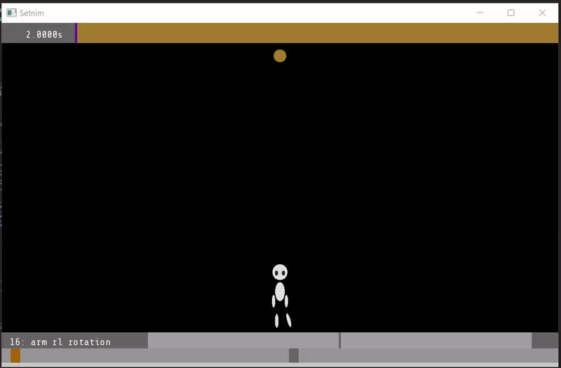
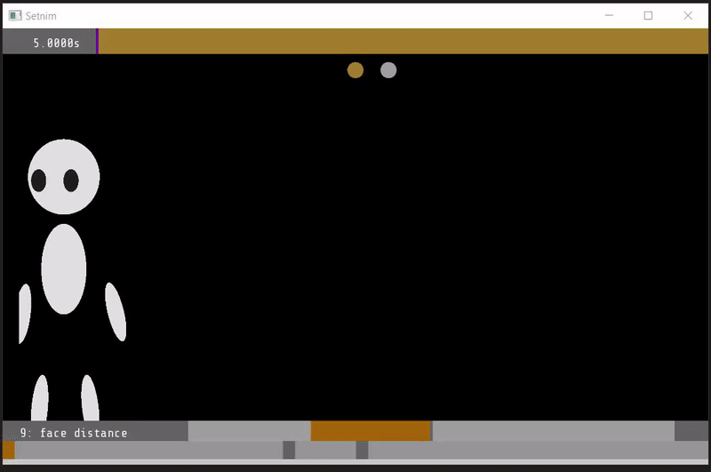
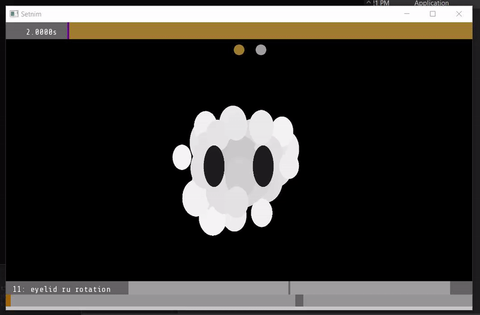
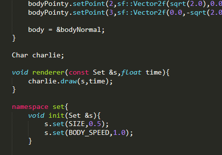

# Setnim

An animation framework for parameterized puppets programmable in OpenGL.  
Made with SFML.  

  

  

  

## Intent

The aim was to provide a simple common interface through which custom puppets could be animated.  
Each puppet would consist of a custom render method which would be passed parameters (ie, `float params[3] = {HEAD_ROTATION, TORSO_POSITION, ARM_ROTATION}`) to render a pose. This software would then asist the user in the creation of sequences of poses, interpolation between poses, and puppet/scene management.  
Hence, the user would be able to make animations!  
  
The advantage of this approach is that the render methods for each puppet would be up to the programmer's choice.  
It wouldn't even need to a puppet! A simple rising-sun background could consist of a single "y-position" parameter, and that would be a valid puppet, even if it was just a parameter for a single-quad shader applied to the whole screen.  
  
Furthermore, integration with the models output by [mesher](https://github.com/zeqe/mesher) could be achieved, to allow smooth animatable meshes and particle fields!  
Swaying fields of grass have never been so cheap :)  

## Project State

Unfortunately, this project is currently abandoned.  
Due to a shift in ambitions, it is unlikely to ever be re-visited.  

## Footnotes

The ghost's name is Charlie.  

  